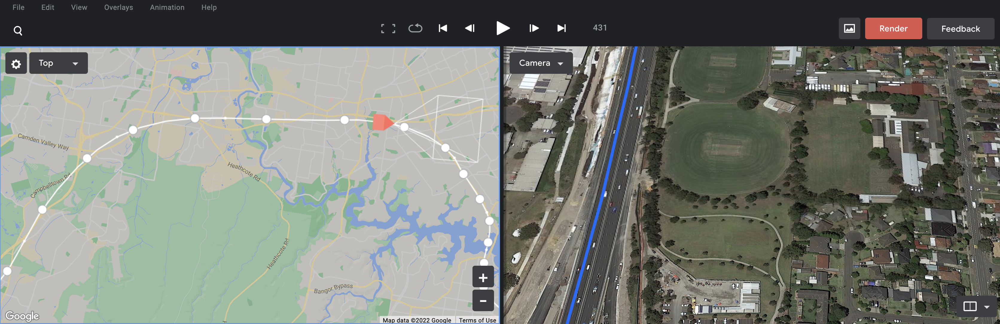

# Google Earth Studio Utilities

[Google Earth Studio](https://earth.google.com/studio/) is a powerful tool for creating satellite imagery-based visuals. It currently supports `kml` import to display routes on a map, but it is left to the user to add keyframes that capture the imported path.

The utilities in this repo generate a new Google Studio project file (`.esp`) with camera keyframes that follow a `.kml` path smoothly from start to finish. The generated `.esp` can be opened in Google Studio and fine tuned.

# Usage
You can generate an `.esp` file from an existing `.kml` path with the following command:  

`python3 kml_to_esp.py map.kml out.esp`

The script `kml_to_esp.py` has a range of arguments to better suit your data (in terms of noise and density). The available options are shown through `python3 kml_to_esp.py -h` which produces the following:
```
positional arguments:
  kml                   Input kml filename
  out                   Output esp filename

optional arguments:
  -h, --help            show this help message and exit
  --n_steps N_STEPS     Number of uniformly-spaced keyframes to add
  --tilt TILT           Angle (in degrees) the camera must be tilted in each keyframe
  --alt ALT             Altitude (in metres) for the camera
  --noise_level NOISE_LEVEL
                        Distance (in metres) between consecutive points to consider them unique
  --moving_avg MOVING_AVG
                        Number of consecutive points to average over for smoother paths
```

# Example

Using a `map.kml` file generated from [Google My Maps](https://mymaps.google.com), after running `python3 kml_to_esp.py map.kml out.esp` and importing `out.esp` into Google Earth Studio, a 200-point camera path is created that smoothly follows the `.kml` data as shown below.  

